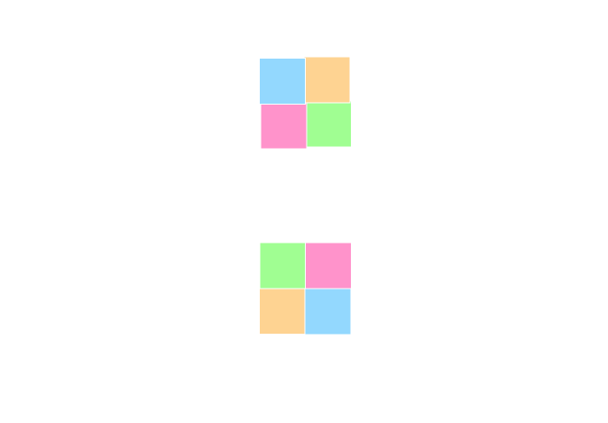

RectLoadingView
===================

## 效果图


## Usage

### Step 1

Add dependencies in build.gradle.

```
    dependencies {
       compile 'com.code4a:rectloading:0.0.3'
    }
```

### Step 2

Simple 

```
<com.code4a.rectloadingview.RectLoadingView
    android:id="@+id/avi"
    android:layout_width="wrap_content"
    android:layout_height="wrap_content"
    style="@style/RectLoadingView.Large"
    />
```

Advance

```
    <com.code4a.rectloadingview.RectLoadingView
        android:id="@+id/avi"
        android:layout_width="wrap_content"  //or your custom size
        android:layout_height="wrap_content"  //or your custom size
        style="@style/RectLoadingView"// or RectLoadingView.Large or RectLoadingView.Small
        android:visibility="visible"  //visible or gone
        app:dotCount="4" or 2
        app:dotLeftTopColor="dotLeftTopColor"
        app:dotLeftBottomColor="dotLeftBottomColor"
        app:dotRightTopColor="dotRightTopColor"
        app:dotRightBottomColor="dotRightBottomColor"
        />
```

### Step 3

It's very simple use just like .
```
   public void start() {
       rectLoadingView.hide();
       // or rectLoadingView.smoothToHide();
   }

   public void stop(View view) {
       rectLoadingView.show();
       // or rectLoadingView.smoothToShow();
   }
   
```

## Thansk

- [AVLoadingIndicatorView](https://github.com/81813780/AVLoadingIndicatorView) .
- [SlackLoadingView](https://github.com/JeasonWong/SlackLoadingView) .


## Contact me

 If you have a better idea or way on this project, please let me know, thanks :)

[Email](mailto:jiangyantaodev@163.com)

[My Blog](http://www.code4a.com)

### License
```
Copyright 2017 code4a

Licensed under the Apache License, Version 2.0 (the "License");
you may not use this file except in compliance with the License.
You may obtain a copy of the License at

   http://www.apache.org/licenses/LICENSE-2.0

Unless required by applicable law or agreed to in writing, software
distributed under the License is distributed on an "AS IS" BASIS,
WITHOUT WARRANTIES OR CONDITIONS OF ANY KIND, either express or implied.
See the License for the specific language governing permissions and
limitations under the License.
```

